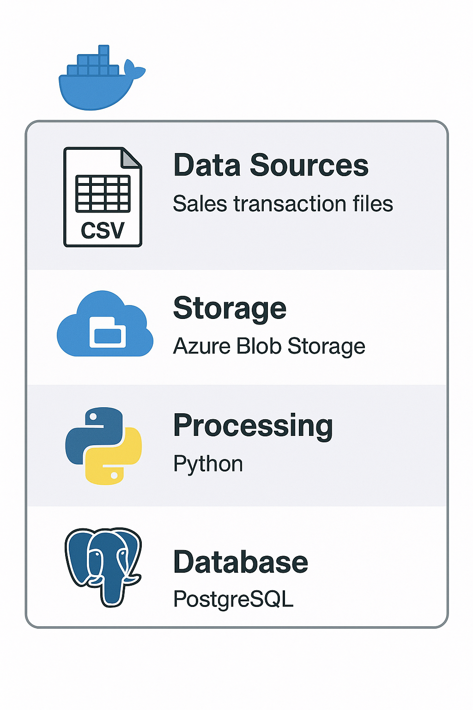
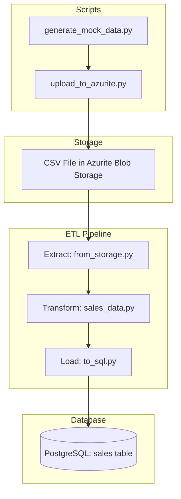
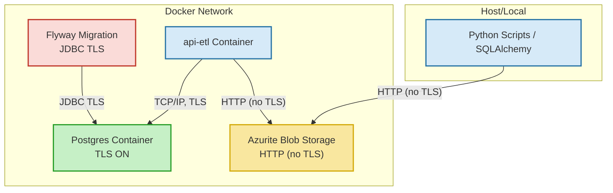

# ETL Pipeline for Sales Data

## Table of Contents
- [Overview](#overview)
- [Features](#features)
- [Architecture](#architecture)
- [Folder Structure](#folder-structure)
- [Setup & Usage](#setup--usage)
  - [Prerequisites](#prerequisites)
  - [Create and activate virtual environment](#create-and-activate-virtual-environment)
  - [Install dependencies](#install-dependencies)
  - [Clone the repository](#1-clone-the-repository)
  - [Generate TLS/SSL Certificates](#generate-tlsssl-certificates-for-secure-connections)
  - [Configure environment variables](#2-configure-environment-variables)
  - [Build and start services](#3-build-and-start-services)
  - [Run the ETL pipeline](#4-run-the-etl-pipeline)
- [ETL Flow](#etl-flow)
- [Schema Management](#schema-management)
- [Error Handling & Logging](#error-handling--logging)
- [Extending & Customizing](#extending--customizing)
- [Troubleshooting](#troubleshooting)
- [TLS/SSL](#tlsssl)
- [Future Improvements](#future-improvements)
- [GitHub Collaboration Templates](#github-collaboration-templates)
- [Authors](#authors)

## Overview
This project implements a modular, event-driven ETL (Extract, Transform, Load) pipeline in Python for processing sales data from CSV files stored in Azure Blob Storage (Azurite emulator) and loading it into a PostgreSQL database. The pipeline is containerized using Docker Compose and supports chunked processing, batch/concurrent loading for performance, schema validation, encryption of sensitive fields, robust error handling, and secure connections using TLS/SSL for both database and storage services.

## Features
- **Event-driven processing:** Automatically triggers ETL when a new CSV blob is detected.
- **Chunked extraction:** Reads large CSV files in memory-efficient chunks.
- **Schema validation:** Validates CSV and SQL schemas, required columns, and data types.
- **Sensitive data encryption:** Encrypts columns flagged as sensitive using Fernet.
- **Data cleaning:** Handles missing values, normalizes strings, and filters invalid rows.
- **Incremental and concurrent loading:** Loads only new records and supports concurrent batch inserts for performance.
- **Centralized configuration:** All environment variables managed via `.env` and `EnvConfig`.
- **Logging:** Detailed logging for all ETL steps and errors.
- **Blob management:** Moves processed blobs to success/fail folders based on ETL outcome.
 - **Secure connections (TLS/SSL):** All database and storage connections use TLS/SSL for encryption in transit.

## Architecture




The data architecture is structured into 5 well-defined, distinct layers to ensure clear separation of concerns, scalability, and maintainability across the data pipeline.

| Layer | Component/Technology | Description and Function |
| :--- | :--- | :--- |
| **1. Data Sources Layer** | CSV Files | Contains raw sales transaction data. These files can originate from various transactional systems, such as Point of Sale (POS), or other internal systems. |
| **2. Storage Layer** | Azure Blob Storage / Azurite | **Cloud Storage:** Azure Blob Storage is used for durable, scalable cloud data persistence.<br>**Local Development:** **Azurite** is used as a full local emulator to replicate Azure functionality, enabling cost-effective development and testing. |
| **3. Processing Layer** | Python (Pandas) | The core of the ETL (Extract, Transform, Load) pipeline. Developed entirely in Python, it utilizes **Pandas** for efficient data manipulation and processing. We implement **chunking** techniques to effectively handle and process files of any size. |
| **4. Database Layer** | PostgreSQL | A robust relational database. This layer is responsible for storing the processed, validated, and transformed data, making it readily available for analysis, reporting, and downstream applications. |
| **5. Infrastructure Layer** | Docker Containers | This orchestrates the entire system. All components are encapsulated within **Docker containers**, providing excellent portability, consistency, and environment isolation across development, testing, and production environments. |

---

### Benefits of the Architecture

* **Modularity:** Clear layer separation simplifies development and troubleshooting.
* **Scalability:** Cloud-based storage and efficient chunking in the processing layer allow handling large data volumes.
* **Consistency:** Docker ensures that the pipeline runs identically in all environments.


### Core Technologies

| Category | Technology | Purpose & Usage |
| :--- | :--- | :--- |
| **Primary Language** | **Python** | Our main programming language. We leverage **Pandas** for efficient data manipulation, **SQLAlchemy** for type-safe database operations, and the **Azure SDK** for cloud storage integration. |
| **Containerization** | **Docker & Docker Compose** | Used for container orchestration. This guarantees that the environment is fully **reproducible** – it functions identically on a developer's laptop, the testing server, and in the production environment. |
| **Database** | **PostgreSQL** | Selected for its robustness, advanced features, and reliability. We configure **SSL connections** and comprehensive **transaction handling** to ensure absolute data integrity. |
| **Database Migrations** | **Flyway** | Utilized for database schema migration management. This means all schema changes are **versioned** and applied automatically and reliably across environments. |
| **Local Cloud Emulation** | **Azurite** | The local emulator for Azure Blob Storage. It allows us to develop and rigorously test locally without incurring cloud costs or requiring constant internet connectivity. |
| **Security & Encryption** | **Cryptography** | Employed for encrypting sensitive data using **Fernet algorithms**. Sensitive data, such as customer information, is encrypted before storage to ensure maximum security. |

---

### Key Benefits

* **Reproducibility:** Docker ensures the code runs the same everywhere.
* **Security:** SSL connections to the DB and Fernet encryption for sensitive data.
* **Efficiency:** Local development and testing via Azurite and powerful data manipulation with Pandas.


## Folder Structure
```
src/
  etl_pipeline/
    main.py                # ETL orchestrator
    extract/
      from_storage.py      # Chunked blob extraction
    transform/
      sales_data.py        # Data cleaning, mapping, encryption
    load/
      to_sql.py            # Batch/concurrent SQL loading
    utils/
      utils.py             # Utility functions (blob ops, chunk size, encryption)
      env_vars.py          # Environment variable management
      table_schemas.py     # SQL schema definitions
      csv_schemas.py       # CSV schema definitions
      mapping.py           # Column mapping logic
      logger.py            # Logging setup
migrations/
  V1__init.sql         # Flyway migration scripts
scripts/
  generate_mock_data.py    # Mock data generator
  init_bucket.py           # Azurite bucket initializer
  upload_to_azurite.py     # Blob upload utility
.env                 # Environment variables
Dockerfile                 # Python app container
docker-compose.yml         # Service orchestration
requirements.txt           # Python dependencies
pyproject.toml             # Python project config
README.md                  # Project documentation
example_data_model/        # Example data models
data/                      # Data files
venv/                      # Python virtual environment
certs/
  server.crt               # TLS/SSL certificate
  server.key               # TLS/SSL private key
```

## Setup & Usage
### Prerequisites

- Docker & Docker Compose
- Python 3.11 (for local dev)

### Create and activate virtual environment
```bash
python -m venv .venv
source .venv/bin/activate  # Linux/Mac
.venv\Scripts\activate   # Windows
```

### Install dependencies
```bash
pip install -r requirements.txt
```

### 1. Clone the repository
```bash
git clone <repo-url>
cd <repo-folder>
```

### Generate TLS/SSL Certificates (for secure connections)
For local development, generate self-signed certificates for PostgreSQL and Azurite:

```bash
mkdir -p certs
openssl req -new -x509 -days 365 -nodes -text \
  -out certs/server.crt -keyout certs/server.key \
  -subj "/CN=postgres"
chmod 600 certs/server.key
```

Use these files in your Docker Compose and service configuration as described in the TLS/SSL Updates section.

### 2. Configure environment variables
Edit `.env` with your settings:
```
ENVIRONMENT=local
AZ_CONTAINER_NAME=mycontainer
AZ_BLOB_URL=http://azurite:10000/devstoreaccount1
AZ_ACCOUNT_NAME=devstoreaccount1
AZ_ACCOUNT_KEY=...
AZ_CONNECTION_STRING=DefaultEndpointsProtocol=http;AccountName=${AZ_ACCOUNT_NAME};AccountKey=${AZ_ACCOUNT_KEY};BlobEndpoint=${AZ_BLOB_URL};
DESIRED_CHUNK_FRACTION=0.25
AVG_ROW_SIZE_BYTES=1024
CHUNK_SIZE=1000
POSTGRES_USER=etl_user
POSTGRES_PASSWORD=etl_password
POSTGRES_DB=dp_db
POSTGRES_HOST=db
POSTGRES_PORT=5432
FERNET_KEY=...
POSTGRES_CONNECTION_STRING=postgresql://etl_user:etl_password@db:5432/dp_db?sslmode=require
```
#### Variable descriptions

- `ENVIRONMENT`: Execution environment (e.g., local, development, production).
- `AZ_CONTAINER_NAME`: Name of the blob container in Azurite/Azure.
- `AZ_BLOB_URL`: URL to access the blob service (Azurite).
- `AZ_ACCOUNT_NAME`: Storage account name.
- `AZ_ACCOUNT_KEY`: Storage account access key. [Connect to the emulator account using the shortcut](https://learn.microsoft.com/en-us/azure/storage/common/storage-use-emulator#connect-to-the-emulator-account-using-the-shortcut)
- `AZ_CONNECTION_STRING`: Full connection string for Azure Blob Storage.
- `DESIRED_CHUNK_FRACTION`: Fraction of memory to use for each CSV chunk.
- `AVG_ROW_SIZE_BYTES`: Average size (in bytes) of each CSV row, for chunk calculation.
- `CHUNK_SIZE`: Number of rows per chunk when processing CSV.
- `POSTGRES_USER`: PostgreSQL database user.
- `POSTGRES_PASSWORD`: Database user password.
- `POSTGRES_DB`: PostgreSQL database name.
- `POSTGRES_HOST`: Host or address of the PostgreSQL server.
- `POSTGRES_PORT`: PostgreSQL connection port.
- `FERNET_KEY`: Secret key for encryption of sensitive data (Fernet).
- `POSTGRES_CONNECTION_STRING`: Full PostgreSQL connection string with SSL parameters for secure connections.

### 3. Build and start services
```bash
docker-compose build
docker-compose up
```

### 4. Run the ETL pipeline

You can upload a CSV file to the configured blob container using the provided script:
```bash
python scripts/upload_to_azurite.py <path_to_csv>
```
Once uploaded, the ETL will process the file automatically or you can trigger manually:
```bash
python src/etl_pipeline/main.py <blob_name>
```

You can also generate example/mock CSV data for testing using the provided script:
```bash
python scripts/generate_mock_data.py <num_rows> [<start_date> [<end_date>]]
```
Where:
  - `<num_rows>`: Optional number of rows to generate (default: 100)
  - `<start_date>`: Optional start datetime (format: YYYY-MM-DD HH:MM:SS)
  - `<end_date>`: Optional end datetime (format: YYYY-MM-DD HH:MM:SS)
The generated file will be saved in the `data/` folder with a timestamped name. You can then upload it to the bucket and process it with the ETL pipeline.

## ETL Flow



1. **Extract:**
   - Streams CSV from Azure Blob Storage in chunks.
2. **Transform:**
   - Validates required columns and types.
   - Applies column mapping.
   - Handles missing values, normalizes strings, filters invalid rows.
   - Encrypts sensitive columns.
   - Calculates derived fields (e.g., `total_amount`).
3. **Load:**
   - Loads DataFrame into PostgreSQL in concurrent batches.
   - Handles errors and logs results.
4. **Move blob:**
   - Moves blob to success/fail folder based on outcome.

## Schema Management
- **table_schemas.py:** Defines the schema for all SQL tables as SQLALCHEMY_SCHEMA dictionaries, one per table. Each dictionary includes the properties type, length, primary_key, encrypt, and require, enabling automatic migrations and centralized validation.
- **csv_schemas.py:** Defines the expected columns in CSV files, their types, and required status.
- **mapping.py:** Maps CSV columns to SQL columns.

## Error Handling & Logging
- All steps log info, warnings, and errors.
- ETL job summary includes chunk results and final status.
- Blobs are moved to appropriate folders after processing.

## Extending & Customizing
- Create a new migration .sql in `migrations` folder.
- Add/update SQL schemas in `table_schemas.py`.
- Add/update CSV schemas in `csv_schemas.py`.
- Update column mapping in `mapping.py`.
- Add transformation logic in `sales_data.py`.
- Optional: Adjust chunk size and memory usage in `.env`.

## Troubleshooting
- Check logs for error details.
- Ensure all required environment variables are set.
- Validate database connectivity and blob storage access.
- For dependency issues, run:
  ```bash
  pip install -r requirements.txt
  ```

## TLS/SSL

This project is configured to use TLS/SSL for secure connections to the PostgreSQL database. The API container, and Flyway migrations all connect to the database using encrypted channels. The following diagram shows the architecture and connection security:



### Azurite and HTTPS

Azurite does not natively support HTTPS in Docker Desktop. For this reason, the storage service is exposed via HTTP in local development. If you need encrypted connections to Azurite, consider these options:

**1. Use an HTTPS proxy (recommended for secure development):**
- Deploy an Nginx container in front of Azurite to terminate HTTPS and forward requests to Azurite over HTTP.

**2. Use real Azure Blob Storage in production:**
- Azure Blob Storage always uses HTTPS for all connections.

**3. Optional: SSH tunnel or VPN:**
- For isolated local environments, you can encrypt traffic to Azurite using a TCP tunnel (e.g., stunnel).
- This is more complex and only necessary if strict local encryption is required.

> Note: For most development scenarios, using HTTP for Azurite locally is acceptable. Always use HTTPS in production.


## Future Improvements

### 1. Schema Configuration Externalization
- **Move schemas to configuration files:** Extract `csv_schemas.py`, `table_schemas.py` and `mapping.py` into external configuration files (JSON/YAML/TOML).
- **Benefits:**
  - **Flexibility:** Allow schema and mapping modifications without redeploying the application.
  - **Dynamic configuration:** Load schemas at runtime from configuration files or environment variables.
  - **Separation of concerns:** Separate business logic from data configuration.
- **Proposed implementation:**
  - Create `config/` directory with files: `csv_schemas.json`, `table_schemas.json`, `column_mapping.json`
  - Modify utilities to load configurations from these files
  - Maintain compatibility with existing configurations during transition

## GitHub Collaboration Templates

This project includes GitHub templates to standardize collaboration:

- **Issue templates:** Located in `.github/ISSUE_TEMPLATE/`, these provide forms for bug reports and feature requests. When you create a new issue in the repository, you can select the appropriate template to ensure all necessary information is provided.
- **Pull request template:** The `.github/PULL_REQUEST_TEMPLATE.md` file helps contributors describe their changes and confirm that code has been manually tested locally (since there are no automated tests yet).
- **Contributing guide:** The `.github/CONTRIBUTING.md` file explains how to contribute, including steps for forking, branching, and submitting pull requests.

These templates help maintain code quality, improve communication, and make it easier for new contributors to participate.

## Authors
- Arancha Leon
- Contributors welcome!